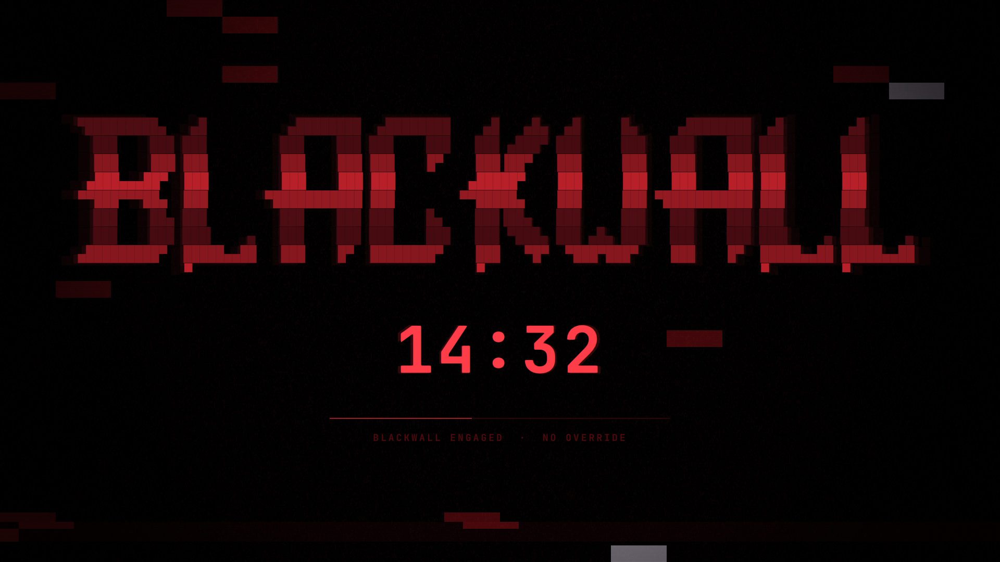

# Blackwall



A timed session lock with no way out. Pick a duration from the bar; the
session locks and stays locked until the timer runs out.

There is no password prompt, no cancel button, and no unlock IPC method.
That is the point.

**This branch also carries NetWatch** — a root daemon that keeps a list of
domains sinkholed, watches the files that do the sinkholing, and puts the wall
on the screen if they are interfered with. The lock above is a thing you
choose for an hour. NetWatch is a thing you decide once. See
[NetWatch](#netwatch) below.

## Install

```bash
omarchy plugin add https://github.com/zdsdeveloper/blackwall.git
omarchy plugin enable zds.blackwall
```

`omarchy plugin add` clones into `~/.config/omarchy/plugins/zds.blackwall/`
(named by the manifest id) and leaves the plugin **disabled** so you can read
the code before running it. Plugins run unsandboxed inside `omarchy-shell`;
that pause is the point, so take it.

Enabling puts the button in the bar's right section. Move it with:

```bash
omarchy bar move zds.blackwall --section center
```

### The opening sequence

Engaging does not cut to the wall. The screen is photographed the instant
before the session locks, and a rift tears that still open until nothing is
left — the desktop pulled toward the hole in strips, its colour draining, and
the wall showing through the gap rather than fading in over it. The still is
kept in `XDG_RUNTIME_DIR`, which is memory, and deleted as soon as the tear is
done with it. Without a runtime directory there is no capture and no sequence.

To watch it without locking yourself out for thirty seconds:

```bash
tools/preview-takeover.sh
```

That captures the desktop and loops the real sequence in an ordinary window
until you close it. Nothing it does touches the lock, the daemon, or any
state.

The sting over it is synthesised, not sampled — `tools/make-takeover-sound.py`
builds `sounds/takeover.mp3` from oscillators, and is committed so the sound
can be changed rather than merely replaced.

### Optional: give it a soundtrack

No audio ships with the plugin, so the lock is silent out of the box. Drop any
audio file into `sounds/` and it loops while locked — the filename does not
matter:

```bash
cp ~/Downloads/whatever.mp3 ~/.config/omarchy/plugins/zds.blackwall/sounds/
```

Recommended: **"Cyberpunk 2077 — Standing in front of the Blackwall
(Ambience)" by Anendale**, which is what this was built against. Source your
own copy; it is not redistributed here. See
[`sounds/README.md`](sounds/README.md) for formats, pointing at a file
elsewhere, and volume.

## Remove

```bash
omarchy plugin remove zds.blackwall
```

That takes the widget out of the bar and deletes the checkout. Two things
live outside the plugin directory and are left behind on purpose — remove
them by hand if you want no trace:

```bash
rm ~/.config/omarchy/zds.blackwall.json              # the persistence toggle
rm -rf ~/.local/state/omarchy/blackwall              # live lock state
```

**Removing the plugin while a lock is engaged does not unlock the session.**
The compositor holds the lock, not the plugin. Let the timer run out first,
or use the recovery path below.

## Requirements

- **Omarchy 4.0+** — the Quickshell shell, `WlSessionLock`, and the
  `omarchy plugin` commands. It will not load on the older waybar-based shell.
- **A monospace font with block-drawing glyphs** (`▀ ▄ █ ░ ▒ ▓`). Any Nerd
  Font has them; Omarchy's default JetBrainsMono Nerd Font is fine.
- **`qt6-multimedia`** *(optional)* — only for the ambience. Without it, or
  with no audio file in `sounds/`, the lock is simply silent.
- **`qt6-shadertools`** *(only to develop)* — supplies `qsb` for rebuilding
  `glitch.frag.qsb`. Not needed to run the plugin; the compiled shader ships
  in the repo.
- **`python3`** — runs `bin/blackwall-file-guard`, which is how the two state
  files are read and written (see [State files](#state-files)). Already present
  on every Omarchy system: `omarchy` depends on `uwsm`, which depends on
  `python`. Nothing is installed with `pip`; the guard uses only the standard
  library.

No network access, no privilege escalation, no systemd units. The only external
processes it starts are `mkdir`/`chmod` for its state directory,
`cat /proc/sys/kernel/random/boot_id`, a `bash` glob to find an audio file, and
`python3 bin/blackwall-file-guard` to touch its own two files.

## Files

| File                     | What it is                                                |
|--------------------------|-----------------------------------------------------------|
| `manifest.json`          | Plugin manifest — one `bar-widget`, one `service`         |
| `BarWidget.qml`          | Bar button, duration menu, persistence toggle             |
| `Service.qml`            | Owns the session lock, the countdown, and both files      |
| `GuardedFile.qml`        | Read/write access to one file, via the guard below        |
| `bin/blackwall-file-guard` | Bounded, no-follow reads and writes (see below)          |
| `tests/test-file-guard.sh` | Exercises the guard against symlinks, FIFOs, and the rest |
| `BlackwallLockView.qml`  | What the lock surface paints, and the ambience            |
| `GhostFaces.qml`         | The apparition layer for the release sequence             |
| `Faces.js`               | The faces, as shaded block text                           |
| `GlitchBackground.qml`   | Static field behind the wall (wraps the shader)           |
| `glitch.frag`            | Shader source                                             |
| `glitch.frag.qsb`        | Compiled shader — what Qt actually loads                  |
| `Logo.js`                | The wall itself, as text                                  |
| `logo.txt`               | Source the logo was generated from                        |
| `Model.js`               | Duration parsing, formatting, config, and the ripple math |
| `sounds/`                | Drop audio here to give the lock a soundtrack (optional)  |

Three files outside this directory:

| Path                                            | What it is                        |
|-------------------------------------------------|-----------------------------------|
| `~/.config/omarchy/zds.blackwall.json`          | User config (the toggle)          |
| `~/.local/state/omarchy/blackwall/deadline`     | Live lock state (mode `0600`)     |
| `~/.local/state/omarchy/blackwall/activity`     | The break count (mode `0600`)     |

Everything under `~/.config/omarchy/plugins/` hot-reloads on save. If a change
does not take, `omarchy-shell shell rescanPlugins` forces a reload — but note
that the QML engine caches a type that *failed* to compile, so after fixing a
syntax error you need `omarchy restart shell`, not a rescan.

## State files

Both of Blackwall's files live at paths that are entirely predictable, and one
of them decides whether a lock is still owed. Qt's `FileView` is not a safe way
to open either: it has no size ceiling, so a read lands whole in the shell's
heap; it has no type check, so a FIFO left at the path blocks the open; and its
atomic write resolves a symlink and writes through to the target.

So neither file is touched through `FileView`. Everything goes through
`bin/blackwall-file-guard`, which validates an already-open descriptor rather
than a path:

```
open(O_NOFOLLOW | O_NONBLOCK) -> fstat(fd) -> read(fd, <= 64 KiB)
```

`O_NOFOLLOW` makes a planted symlink fail at `open()`. `O_NONBLOCK` is what
stops a FIFO from hanging the open itself — the one check that cannot be made
after the fact. Because the type, owner, mode and size are checked against the
descriptor and not the path, there is no window in which the file can be swapped
underneath the check. Writes go to a fresh `0600` temp file in the same
directory and are renamed into place; `rename(2)` replaces the name rather than
writing through a link.

A file is refused if it is not a regular file, is not owned by you, is writable
by other users, is larger than 64 KiB, or sits in a directory other users can
write to. The state directory is created `0700`.

The files get deliberately different treatment:

- **`deadline`** and **`activity`** are Blackwall's own, in a directory nothing
  else uses. Symlinks
  are refused. A write may take the name back from something planted there —
  refusing forever would quietly stop them persisting, which would turn
  restarting the shell into a way out of a lock or a break. They are kept apart
  rather than folded into one file: they answer different questions, are
  written on completely different rhythms, and a counter that will not parse
  must not cost a lock that is still owed.
- **`zds.blackwall.json`** is *yours*. Symlinks are allowed, so keeping it in a
  dotfiles repo and linking it into place works; the link has to resolve inside
  `$HOME` and the target still faces every check above. Nothing there is ever
  replaced or deleted. If the path is refused, Blackwall runs on defaults in
  memory and will not write to it at all — `blackwall status` reports
  `configWritable: false`, and the settings commands say so.

A refused read never stalls startup: it resolves as "no saved lock", exactly as
an empty file would, and every guard run has a 5-second watchdog behind it.

All of the above is covered by `tests/test-file-guard.sh`, which plants each
kind of entry at a real path and checks what the guard does with it:

```bash
./tests/test-file-guard.sh
```

## How it works

The service owns a Quickshell `WlSessionLock` — the same `ext-session-lock`
primitive `omarchy.lock` uses. While it holds the lock the compositor routes
all keyboard and pointer input to the lock surface and nothing else, so input
is blocked at the compositor, not by a window that merely covers the screen.

It is a `service` rather than part of the bar widget because bar widgets are
instantiated once per monitor and a session lock has to be a singleton. The
widget reaches the service through `shell.serviceFor("zds.blackwall")`, and
falls back to `omarchy-shell blackwall engage <seconds>` if that lookup fails.

Three things keep the wall standing:

- **Wall-clock deadline.** The countdown is `deadline - Date.now()`, not an
  accumulated tick count, so a suspend, a resume, or a late timer callback
  cannot stretch or shorten the lock.
- **Idle suppression.** With no input arriving, the idle monitor keeps
  counting and would fire `omarchy-system-lock` on top of us at `idle.lock`.
  The service holds the idle cycle off for the duration, without touching the
  stay-awake state file or its bar indicator.
- **Re-assertion.** If the compositor hands the session lock to something
  else while time remains, the service takes it back (bounded to 20 attempts)
  and tells `omarchy.lock` to stand down.

## The reconnection sequence

The countdown reaching zero does not unlock anything. It starts a ~4.6s
sequence — the wall opening — and only the end of that hands the session back.

| Fraction    | Phase     | What happens                                              |
|-------------|-----------|-----------------------------------------------------------|
| 0.00 – 0.16 | `breach`  | BREACH DETECTED flickers at ~7Hz, glitch and ripple spike |
| 0.16 – 0.70 | `press`   | Faces come up against the wall, block meter fills          |
| 0.70 – 0.88 | `surge`   | WALL FAILING, everything peaks, the wall goes white-hot    |
| 0.88 – 1.00 | `shatter` | Rows part and fade, then a white seal shuts to a point     |

Every curve — glitch intensity, ripple amplitude, bleaching, face pressure,
shatter travel, the meter, the audio fade — is a pure function of one
`releaseProgress` value in `Model.js`. Nothing has its own timeline, so
nothing can drift out of step with anything else.

`Service.tick` runs at 5Hz normally and **16ms while releasing**: the
countdown only ever renders whole seconds, but the sequence derives its
motion from the same clock, and at 200ms the shatter steps visibly. One
clock, sped up, rather than a second timeline that could drift from the
authoritative one.

### It always opens

Two things guarantee the session comes back:

- **The watchdog.** `releaseWatchdog` fires at `RELEASE_MS + 2000` and
  unlocks regardless of what the progress clock is doing. A ceremony that can
  hang is a lock that never opens. This path is tested by shortening the
  watchdog until it wins the race; it logs `released: watchdog`.
- **The state file is cleared when the sequence starts**, not when it ends.
  The timer is genuinely over at that point, so a crash mid-ceremony comes
  back as an unlocked session, never as a resumed lock.

While the sequence runs the lock is still held — `holding` is
`engaged || releasing`, and every guard that keeps the wall up asks that
rather than `engaged`, or the wall would drop the instant the timer hit zero
and the sequence would play to an empty room.

### The faces

`Faces.js` holds three shaded block faces in the same character vocabulary as
the logo — a soft ░ halo falling off to a solid ██ core, with eyes and mouth
carved out to empty. Negative space is what makes them read as faces at this
size; the halo is what keeps them reading as apparitions rather than stickers.
They are generated from ellipse falloff by `scratchpad/faces.py`, so every row
is the same width. Hand-edit freely, but keep the rows rectangular.

`GhostFaces.qml` runs a pool of five independent apparition slots. Each picks
a face, a position, and a scale, swells out of nothing, holds, and sinks back.
Nothing is synchronised between slots, so the layer never pulses in unison.

**One trap worth knowing about**: the timings live on the slot, not on the
animation. A `ScriptAction` that rewrites the durations of the
`SequentialAnimation` containing it restarts that group, which re-fires the
script, which restarts it again — an infinite synchronous loop that hangs the
QML engine at component creation with no error message at all. Animation
durations are only ever written while the animation is stopped; all the
per-cycle jitter lives on a `Timer` interval, which is safe to rewrite at any
point.

## Persist Across Reboot

The menu carries one setting, stored in `~/.config/omarchy/zds.blackwall.json`:

```json
{
  "version": 1,
  "persistAcrossReboot": true,
  "soundPath": ""
}
```

(`soundPath` is the ambience override — see [`sounds/README.md`](sounds/README.md).
Empty means auto-discovery.)

The file is created with defaults on first run, is watched, so hand-edits take
effect without a restart, and is also reachable over IPC.

**ON** — a lock outlives a reboot and resumes for whatever time is left.

**OFF** — the lock is session-only. A reboot clears it.

Note what OFF does *not* mean: inside a single boot the lock always comes back,
however the shell went down. Restarting or crashing the shell is not an escape
hatch either way — only a reboot is, and only with the toggle off.

Telling those two cases apart is why the state file carries a boot id:

```json
{ "version": 1, "deadline": 1787530843043, "bootId": "7aa0960c-…" }
```

On resume the stored id is compared against
`/proc/sys/kernel/random/boot_id`. Same id means the shell restarted; a
different id (or a state file old enough to have no id at all) means the
machine rebooted. Only the second case consults the toggle.

## Restarting the shell while locked

`omarchy restart shell` **refuses** while a Blackwall lock is up — Omarchy
guards against restarting a live lock client and stranding the session behind
Hyprland's failsafe. That is the desired behaviour here, so it is left alone.

If the shell dies anyway, the next one resumes the lock and tells
`omarchy.lock` to stand down — otherwise its stranded-lock recovery would put
a password prompt in front of an unexpired Blackwall, which would be the
escape hatch this plugin exists to not have.

## Recovery

This needs a TTY, and it is deliberately not reachable from the locked
session:

1. `Ctrl+Alt+F2`, log in.
2. `rm ~/.local/state/omarchy/blackwall/deadline`
3. `pkill -f 'quickshell.*omarchy/shell'`

The process is `quickshell -n -p /usr/share/omarchy/shell`, so a pattern of
`quickshell -p` will not match it.

Hyprland keeps the screen locked when a lock client dies, so on the next shell
start `omarchy.lock` picks up the stranded lock and offers its normal password
prompt. Skipping step 2 means Blackwall resumes instead.

## Commands

```bash
omarchy-shell blackwall status         # JSON: engaged, remaining, deadline
omarchy-shell blackwall remaining      # MM:SS
omarchy-shell blackwall engage 600     # lock for 600 seconds
```

```bash
omarchy-shell blackwall persist            # true / false
omarchy-shell blackwall setPersist false   # flip the toggle
```

`engage` clamps to 30 seconds minimum and 12 hours maximum, and is refused
while a lock is already up. There is no `release`. `setPersist` is safe to
call while locked — it decides what happens at the *next* boot, so it is not
an unlock path.

## NetWatch

A root daemon that keeps a list of domains sinkholed and notices when
something changes that.

The lock above is voluntary and temporary — you pick an hour, it ends. NetWatch
is neither. It is for the case where the decision has already been made and the
job of the software is to keep it made, including against the person who
installed it. There is no unblock command, no removal command, and no
disable flag, and their absence is the feature rather than an omission.

### Install

```bash
netwatch/install.sh
```

Needs root: it installs a systemd unit, a package-manager hook, and the daemon
itself. Re-run it after pulling; it restarts the service and waits until the
daemon answers before reporting success.

### Containing a domain

```bash
netwatchctl add xnxx.com          # from anywhere, no root needed
netwatchctl status                # counts, and anything found weakened
netwatchctl status --json         # the whole report, which the panel reads
netwatchctl log --limit 40        # the ledger, newest last
```

Adding is deliberately unprivileged — the control socket is world-writable,
because making it hard to *add* would be protecting the wrong direction. The
list only grows.

Each domain becomes four lines in `/etc/hosts`: an IPv4 sink and an IPv6 sink,
for the bare name and for `www.`. Both families matter, because the resolver
consults them independently and a v4-only entry leaves a v6 route open.

### The station

A window, from the bar menu → **NetWatch Station…**

It shows what is contained, what is verified as enforced right now, the
escalation state, and the ledger as a live console. The contained list is
redacted by default and reveals on a click, because a station left open on a
second monitor should not read the list out to the room; the console and the
resolver panel redact under the same flag, since every add writes the domain
into the log in plain text.

Beside the console are the two panels that are not about the wall at all.
**POST** carries the operator's name and how long they have been continuously
at the machine, its bar filling across the stretch; **STAND DOWN** carries what
is left before a break is owed, its bar emptying as the other one fills. Both
read the activity clock the shell already keeps — the station is a second view
onto it, not a second copy, and nothing on this surface can reset it or put it
off. While the compositor reports nobody at the machine the count is held
rather than running, and both panels say so instead of quietly freezing.

The count is written down, so it survives. This matters more than it sounds:
the shell restarts on a theme change, on any edit to any plugin, and on a
crash, and while the stretch lived only in memory each one of those handed out
a fresh three hours — which made the one thing deliberately not a choice into a
choice, and an easy one.

The rule on the way back up is the same rule the clock uses while running:
time the shell was not there is time away from the machine, because there is no
honest way to call it anything else. Away past the reset and being away *was*
the break, so the stretch is gone. Short of it, the count is picked up where it
was left. A reboot needs no special case — the machine being off is the longest
kind of away there is, and if it was off for two minutes then two minutes is
all that is owed to it.

### The resolver sweep

Every five minutes the daemon asks the system resolver where each contained
name actually points, and the station draws one cell per subject.

This answers a question the file cannot. `/etc/hosts` carrying the right lines
is a claim about a file; it is not the same claim as "when something on this
machine looks that name up, it does not get the real address". The gap between
them is where a block actually fails — `nsswitch.conf` ordering, an
application's own DNS-over-HTTPS resolver, a stale `systemd-resolved` cache, a
namespace with its own hosts file.

It resolves and nothing more. It never connects and never speaks HTTP: opening
a socket to a site NetWatch exists to block would be a strange way to check
that it is blocked. When the wall is working every probe is answered out of
`/etc/hosts` and no query leaves the machine. The one case where a query does
leave is a name that is genuinely no longer sunk, which is exactly the case
worth knowing about.

A leak found this way is reported loudly and never escalates. A resolver
returning a real address can as easily be a stale cache or a VPN's nameserver
as it can be tampering, and a twenty-minute lock for a DNS hiccup would be a
bad trade.

### What it watches, and what happens

Every thirty seconds the daemon repairs what it owns and checks what it
cannot: the sink lines, the browser policy that pins DNS-over-HTTPS off, its
own unit file, and the append-only flag on the ledger.

Weakening any of those is a breach. The first one asks you a question on a
locked surface; a second one inside six hours puts the Blackwall up for twenty
minutes. The ladder counts unanswered breaches, not total ones.

A system update is not tampering. Package transactions are recognised as such,
so `pacman -Syu` rewriting a managed file is repaired quietly rather than read
as someone taking the wall apart.

### Files

| Path                                     | What it is                                     |
|------------------------------------------|------------------------------------------------|
| `netwatch/install.sh`                    | Installs the daemon, unit, hooks and CLI       |
| `netwatch/bin/blackwall-netwatch`        | The daemon entry point                         |
| `netwatch/bin/netwatchctl`               | The control CLI                                |
| `netwatch/blackwall_netwatch/daemon.py`  | The repair loop, the ladder, and status        |
| `netwatch/blackwall_netwatch/hosts.py`   | The `/etc/hosts` region and how it is spliced  |
| `netwatch/blackwall_netwatch/integrity.py` | What "weakened" means, in one place          |
| `netwatch/blackwall_netwatch/probe.py`   | Resolution sweeps                              |
| `netwatch/blackwall_netwatch/provenance.py` | Telling a package transaction from tampering |
| `netwatch/blackwall_netwatch/ledger.py`  | The append-only record                         |
| `netwatch/tests/`                        | The daemon's tests                             |
| `BlackwallPanel.qml`                     | The station                                    |
| `Station*.qml`                           | Its instruments                                |
| `TakeoverView.qml`, `takeover.frag`      | The lock's opening sequence                    |

The blocklist itself is kept outside this repository, under `/var/lib`. It is
nobody else's business, and a public repo is the wrong place for it.

Removing the shell plugin takes the station and the bar widget away. It does
not affect NetWatch, which is a system service and does not live in this
directory.

### Tests

```bash
PYTHONPATH=netwatch python3 -m unittest discover -s netwatch/tests -t netwatch/tests
node tests/model.test.js
tests/run-qml-tests.sh
```

The QML tests run offscreen and need no compositor. `qmltestrunner` ships with
`qt6-declarative` and lives in `/usr/lib/qt6/bin`, which is not on `PATH`.


## Tuning the look

Everything visual lives in `BlackwallLockView.qml`:

- `rippleStrength` (default `0.14`) — sideways travel per slice, as a
  fraction of the font size. The block art only survives displacement well
  under one character cell; much past `0.2` and the rows shear into mush.
- `sliceCount` — one band per character row. Slicing finer puts the shear
  line through the middle of the glyphs.
- The `phase` animation (2600ms) drives the travelling wave; the `breath`
  sequence (1900ms in, 2500ms out) drives the swell.

Preset durations and the 30-minute warning threshold are `PRESET_MINUTES` and
`WARN_MINUTES` in `Model.js`. The custom field accepts 1 to 720 minutes
(12 hours, `MAX_SECONDS`); anything longer is clamped rather than refused.

The confirmation screen always spells out the real duration — "The session
locks for 8 hours" — so read that line before engaging. It is the last point
at which a mistyped number is still recoverable.

### The glitch field

`glitch.frag` is GLSL; Qt 6 will not accept it as an inline string the way Qt 5
did, so it has to be baked. **After any edit, rebuild it or nothing changes:**

```bash
qsb --qt6 -o glitch.frag.qsb glitch.frag   # /usr/lib/qt6/bin/qsb
```

Uniforms are all scalar floats so std140 packs them consecutively with no
alignment traps. `intensity` is driven from the lock view and breathes with
the wall. If the shader ever fails to load the effect hides itself and the
surface falls back to flat black — a broken background must never be the
reason the Blackwall does not come up.

### The sequence

Phase boundaries, durations, and every curve are at the bottom of `Model.js`.
`RELEASE_MS` sets the total length; the watchdog tracks it automatically.
Face count, opacity, and colour are at the top of `GhostFaces.qml`.

### The ambience

Whatever audio is in `sounds/`, looped at volume `0.3` (`audioVolume` in
`BlackwallLockView.qml`), fading out across the shatter so it is not cut off
mid-note when the session hands back. See [`sounds/README.md`](sounds/README.md).

Resolution order, done at startup and again whenever the config changes: an
explicit `soundPath` in the config file, then the first audio file in
`sounds/` regardless of name, then nothing. When nothing resolves,
`soundSource` stays empty, no player is built, and the lock is silent — that
is the entire missing-file handling.

On a multi-monitor setup one lock surface exists per output, all running the
same view. Exactly one claims the audio via `Service.claimAudio()`, or the
ambience plays once per monitor slightly out of phase.

## License

GPL-3.0-or-later. See [LICENSE](LICENSE).

Copyright (C) 2026 Zamil Suarez.

**No audio is distributed with this plugin.** The recommended track —
"Cyberpunk 2077 — Standing in front of the Blackwall (Ambience)" by Anendale —
is named in the docs but not included, because it is not mine to license.
`sounds/` is gitignored: whatever you put there is yours and stays local.
